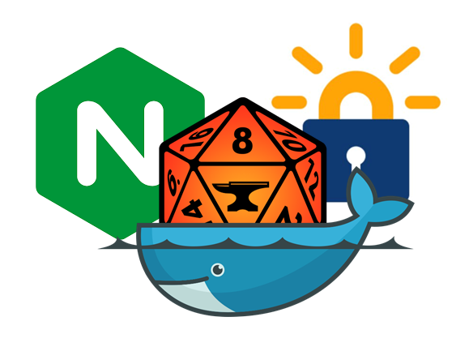

# Foundry Swag Docker

version 0.08 - Archon

This is a how-to on running foundry-vtt on your home server 24/7 in a docker container and securing the connection using nginx and letsencrypt. If that does not mean anything to you, this is basically a how to on running a reasonably secure version of foundry. It is: 
- **containered** - even if someone is able to hijack your foundry system through a vulnerability or by guessing your password, they cannot go any further. they're basically stuck in your container. It also has all sorts of portability and scalability advantages that do not really matter for your single home server.
- **encrypted** - the connection between your player's PC and your server is encrypted, which means that other users cannot easily steal your password or hijack your connection.
- **not idiot proof** - you may notice I use some careful language. That is because, while I know this will make you more secure than doing nothing, there is no such thing as an unhackable system. So, please **choose a strong password**setting-up-foundry-vtt and **update your system**. Also, don't go around daring other people to hack you. That's just stupid.

# Disclaimer
* This guide is geared towards users who want to host foundry 24/7. That assumes you have a home server or some other dedicated hardware (even a raspberry pi) that player and the GM can always access from the internet. If you are only running foundry when you have a game, or if you only need your players to access the game from your LAN, this may be overkill. Then again, you're not paranoid if they're *really* out to get you.  
* This guide is written by me, based on my own experience self-hosting foundryVTT. There are bound to be mistakes in this guide. Please contact me if I missed anything or if you feel this guide could be improved. Or, you know, make a pull request. this is Github after all.
* I'm assuming you have a passing familiarity with Linux, the terminal and a rudimentary understanding of containers. I may forego or adjust this assumption in the future, but right now it is what it is. 
* I'm assuming you own a licence key for [foundry-vtt](https://foundryvtt.com/)
* I'm assuming you have a static IPv4 adress. find out what your IP is easily using www.whatsmyip.org
* Actually, this will even work if you dont have a static IPv4 adress, as long as you use duckdns (see below)

# Overview
This guide is set up in 4 steps:
* [Preparations](#preparations)
* [Setting up the host](#setting-up-the-host) (the system or server you will be using to run foundry vtt)
* [Setting up the containers](#containers)
* [Wrapping up](#wrapping-up)

# Preparations
The preparations are about making sure you have everything ready to install and run foundry. Besides the licence key and the static ip (which I assume you already have), you will also need a domain name, as that is what the letsencrypt ssl certificate is attached to.

## Getting a domain name
You basically have two choices: a fancy pansy full domain like AgeOfWorms.com or TheCityOfSharn.org (or whatever you campaign or setting is called), or a free subdomain like mycampaign.duckdns.org. The .org, .com and .net domains are paid and usually start at $8,- per year, while duckdns.org is completely free. If you want a full domain name, shop arround a bit. prices vary and sometimes you can get the domain at a discount. 
the steps are :
### full domain name (like godaddy.com or domains.com) 
* register the domain name
* add (or replace) your IP adrress to the dns A record. The details depend on your provider, but the result should be something like this:

      name       type     content             ttl
      www        A        your.ext.ip.adr     24H
      @          A        your.ext.ip.adr     24H

What this does is tell your provider that you would like to forward trafic for www.yourdomain.com and yourdomain.com to the ip address your.ext.ip.adr (e.g 66.102.13.99). The provider will the tell other DNS servers that whenever someone asks for the adresses you specified, they should forward likewise. Those providers tell other providers, etc. etc. This is called propagation. this is quite fast, but the internet is a big place, so it still takes a couple of hours before all DNS servers are aware of your new domain name. 

### duckdns(the cheap and easy option)
* create an account with duckdns.org
* enter the domainname you want to register
* duckdns will look up your public IP and fill that in. If it's incorrect for whatever reason, fill in the correct ip adress
* duckdns will also keep your IP updated if you dont have a fixed IP address. 

### Test 
test that the domain resolves to the correct IP
  * go to www.mxtoolbox.com/DNSLookup.aspx 
  * enter your domain name
  * verify that it resolves to your IP address. If it doesnt, wait a bit and try again. 

## Hardware selection
Here's a secret. [You dont need powerfull hardware to host a foundry-vtt server](https://foundryvtt.com/article/requirements/). A raspberry pi (4B) will do, as will a NAS or NUC. Or, if you dont mind, use an old desktop or laptop as a server. 
What you need is: 
* one or two core CPU's (anythng over 1Ghz will do)
* 1GB ram
* at least 1GB disk space

In my experience, the biggest bottleneck for a smooth running game is for your server to serve all your assets quickly. Make sure you are using an SSD (so upgrade that if you are using old hardware), and have a good, wired connectiom. If you are going with a raspberry pi, make sure you it's a Pi 4B as you will want usb 3.0 and gigabit ethernet.

# Setting up the host
This is about configuring your host machine (which we discussed in the hardware selection section just now) as a server. If this is not a NAS, I recommend doing a fresh install of your OS of choice. I assume this will be some sort of BSD or Linux system; such as Raspbian, Debian, or perhaps Proxmox or similar. I won't go into the details of doing this. The rest of this tutorial assumes you have Debian installed (mostly because that's what I'm running).

### IP address
Make sure your host has a static IP address
Make a note of the ip address of you host. on Debian type:

    ip addr

You will also need a way to access your host and the terminal. I assume you are familiar with ssh or [PuTTY](https://www.putty.org/), so I won't go into it here.  

Anyway, before we start, lets make sure everything is up to date:

    sudo apt update
    sudo apt upgrade

## Install docker
Docker has a really good install guide for multiple systems. 

[guide for Debian](https://docs.docker.com/engine/install/debian/)

There are also some recommended [post-install steps.](https://docs.docker.com/engine/install/linux-postinstall/) I personally configure docker to be managed by  as a non-root user, and I configure docker to start on boot.  

## Setting up a data folder for your resources
It's a good idea to create a folder where you will store all your art assets in one easily searchable place. As your library will probaby grow (god knows it never shrinks), its a good idea to put some thought into the organsiation now, as its a pain to change it later. You can put this is your home directory (/home/user/resources) or anyplace else that makes sense for you. 
  
I personally use a structure:
  
- resources
  - assets
  - maps
  - tokens
  - campaign specific stuff. 
    
For the rest of the guide, I am assuming you hae a folder called resources that contains all this stuff. 

## setting up the folders for your containers
Create a folder to store the the container data. Where is is depends on your system configuration. If you are using a raspberry pi, the best place may the your home directory. 
            
      mkdir -p ~/swag-foundry/foundry
      mkdir -p ~/swag-foundry/swag
      cd ~/swag-foundry
      
Now is also a good time to download the foundryvtt-0.x.x.zip file and copy it into this directory
      
## Configure your router
You need to forward http and https trafic to your host. You do this by configuring your router to forward port 80 and port 443 trafic from WAN (the internet) to your host IP. Unfortunately, different routers do this is in different ways.  [This guide](https://www.noip.com/support/knowledgebase/general-port-forwarding-guide/) has some help for different brands of routers. 

# Containers
This section is going to be about selecting and configuring your containers. We are going to combine foundry and Swag into a single stack, with docker taking care of most of the plumbing, such as the networking between the containers. 

## Preparing Foundry
There is currently no official foundry-vtt container, but there are plenty of options created by fans. Which one is the best is going to vary over time. Have a look on [foundryvtt.com](https://foundryvtt.wiki/en/setup/hosting/Docker) for some o the more popular options. Two of my favorites:
- https://hub.docker.com/r/felddy/foundryvtt is quite popular and seems easy to set-up and configure. If you go this route, mae sure you use secrets.json to store your password and key 
- https://github.com/BenjaminPrice/fvtt-docker (aka direckthit) strikes a  happy medium (for me) between convenience and security. basically, you download the zipfile yourself and a script in the container does the rest. No credentials to store, no credentials to accidentally leak.
      
for this guide, I'm using direckthit. 

## SWAG
Linuxserver.io has made an excellent set of containers. I personally have a bunch of them running on my home server. One of the best ones is [SWAG](https://docs.linuxserver.io/general/swag), a container that combines Letsencrypt, nginx, a reverse proxy and fail2ban. Trust me, it's cool.   

What is does, handle your incoming connections and directs them to the correct server, while keeping the bad stuff out. 

## Deploying the stack
We are going to create a configuration file for docker that tells it how to run our swag/foundry stack:

    nano docker-compose.yaml

copy the following into the file: 

### using full domain name 
    version: "3.8"

    services:
      foundry:
        container_name: foundry
        hostname: foundry
        image: direckthit/fvtt-docker:latest
        expose:
          - 30000
        volumes:
          - path/to/your/foundry/data/directory:/data/foundryvtt     # replace with the correct path to your foundry config dir
          - /path/to/your/resources:/data/foundryvtt/Data/resources  # replace with the correct path to your resources
          - /path/to/your/foundry/zip/file:/host                     # replace with the correct path to your foundry-x.x.x.zip file
        restart: unless-stopped
      

      swag:
        image: ghcr.io/linuxserver/swag
        container_name: swag
        cap_add:
          - NET_ADMIN
        environment:
          - PUID=1000
          - PGID=1000
          - TZ=Europe/Amsterdam # Change to your timezone
          - URL=yourdomain.com   # replace with your domain name
          - SUBDOMAINS=www 
          - VALIDATION=http
          - EMAIL=address@example.com #sdd your email address here (optional)
        volumes:
          - /path/to/your/swag/config:/config  # replace with the correct path to your swag config dir
        ports:
          - 80:80
          - 443:443
        restart: unless-stopped

### using duckdns
    version: "3.8"

    services:
      duckdns:
        image: ghcr.io/linuxserver/duckdns
        container_name: duckdns
        environment:
          - PUID=1000
          - PGID=1000
          - TZ=Europe/Amsterdam      # Change to your local timezone
          - SUBDOMAINS=mysubdomain   # Change this to your DuckDNS subdomain name.
          - TOKEN=blah-blah-blah     # Put your DuckDNS token here
        restart: unless-stopped

      foundry:
        container_name: foundry
        hostname: foundry
        image: direckthit/fvtt-docker:latest
        expose:
          - 30000
        volumes:
          - path/to/your/foundry/data/directory:/data/foundryvtt     # replace with the correct path to your foundry config dir
          - /path/to/your/resources:/data/foundryvtt/Data/resources  # replace with the correct path to your resources
          - /path/to/your/foundry/zip/file:/host                     # replace with the correct path to your foundry-x.x.x.zip file
        restart: unless-stopped

      swag:
        image: ghcr.io/linuxserver/swag
        container_name: swag
        cap_add:
          - NET_ADMIN
        environment:
          - PUID=1000
          - PGID=1000
          - TZ=Europe/Amsterdam            # Change to your timezone
          - URL=subdomain.duckdns.org      # change this to your DuckDNS hostname
          - VALIDATION=http
          - DUCKDNSTOKEN=blah-blah-blah    # Put your DuckDNS token here
          - EMAIL=address@example.com      # Change to your email address (optional).
        volumes:
          - /path/to/your/swag/config:/config  # replace with the correct path to your swag config dir
        ports:
          - 80:80
          - 443:443
        restart: unless-stopped

In environment you need to replace:
* TZ=Europe/Amsterdam --> enter your timezone here. 
* URL=yourdomain.com --> add your domain here. Do not add www to the url. That will be covered in the subdomains section. For duckdns add your full domain here. 
* DUCKDNSTOKEN=blah-blah-blah --> the duckdns token on your duckdns page

In volumes, replace the following paths:
* /path/to/your/foundry/data/directory --> the directory you created for your persistent game data (probably /home/user/swag-foundry/foundry)
* /path/to/your/resources --> the directory you created for your resources. (probably /home/user/resources)
* /path/to/your/foundry/zip/file --> the place where you stored foundryvtt-0.x.x.zip (probably /home/user/swag-foundry)
* /path/to/your/swag/config --> replace this with your config file. (probably /home/user/swag-foundry/swag)
Save the docker-compose.yaml file.
   
run:
      
      docker-compose up -d

This will configure the container and run in detached or daemon mode.      
      
## Configure reverse proxy

Look into the swag config files.

cd  ~/swag-foundry/swag/config/nginx/site-confs/

You should add an entry for foundry:

    nano foundryvtt

Add the following content to the file:

    # only serve https
    map $http_upgrade $connection_upgrade {
            default upgrade;
            '' close;
        }

    server {
            listen 443 ssl http2;
            server_name yourdomain.com www.yourdomain.com;  #add your domain name here. if you want to use both with and without www add both here.

            # make sure ssl is enabled
            include /config/nginx/ssl.conf;

            client_max_body_size 0;
            ssl_session_cache shared:SSL:10m;
            proxy_buffering off;

            location / {
                include /config/nginx/proxy.conf;

                resolver 127.0.0.11 valid=30s;

                set $upstream_proto http;
                set $upstream_app foundry;
                set $upstream_port 30000;
                proxy_pass $upstream_proto://$upstream_app:$upstream_port;
                } 
    }

Save and close.

Restart swag, so that the new config is loaded.

    docker-compose restart
    
Verify everything works by going to www.yourdomain.com. You should see the foundry login screen.

## Updating 
updating is done by stopping, removing and redeploying the stack. Before you do this, **shut down your game world.** you may want to **create a backup** as well. 
      
run     
      
      docker-compose rm --stop
      docker-compose up -d      

Again **close your world** and **back up your data**
      

# Wrapping up
Some things not covered here, but which may be useful:

* **backups** make sure you backup your world regularly. I persoanlly have a script that creates a backup every morning using rsync. I may add a how-to later if people are interested
* **searchable resources** Foundry's search function, quite frankly, sucks. My workarround is to have a seperate container running [piwigo](https://piwigo.com/) a free photo album (like google photo's) that allows me to search different photo's based on keywords. So if I'm looking for a chest, or a candle or a bridge to plop into my game I can easily do that.  
* **HTTP Basic auth** an extra authentication step that limits people's access to your foundry server, even before they hit the logon screen. I may upgrade this to a best practice, but I want to test it out for myself first. A How-to guide can be found [here](https://docs.nginx.com/nginx/admin-guide/security-controls/configuring-http-basic-authentication/).
* **portainer** portainer adds some features to docker that look good and may be helpful. This includes a web inteface and some cool tools to manage your containers. there's a short guide below:

## (optional) Install portainer
Portainer is a container management system. It basically adds a web interface to docker and gives you some handy tools. You can absolutely do without. It just makes life that little bit easier. 

As portainer itself runs in docker, deploying it is as simple as running two commands

     docker volume create portainer_data

This creates a persistent place to store some of the container's data. Ususally containers will lose all data when you restart the container. This is a feature that makes containers more predictable and more secure. But sometimes you need certain data, such as config files to remain after you have restarted a container. That is where volumes come in. Basically you are telling docker to reserve a place called portainer_data where this data can be stored.   
     
     docker run -d --name=Portainer --hostname=Portainer -p 8000:8000 -p 9000:9000 --restart=always -v /var/run/docker.sock:/var/run/docker.sock -v portainer_data:/data -e TZ='Europe/Amsterdam' portainer/portainer-ce
     
This tells docker to start portainer. The variables are:

    docker run               --> tell docker to run a container
    -d                       --> run in daemon or detached mode. basically run in the background
    --name=Portainer         --> the name that docker uses to identify this container
    --hostname=Portainer     --> the name other computers use to identify this portainer on the network
    -p 8000:8000             --> map port 8000 on your host to the same port in the container. Port 8000 is used mostly for managing other portainer instances, so I'm not sure if you need this. 
    -p 9000:9000             --> map port 9000 on your host to the same port in the container. This means that users that visit http://<hostip>:9000 will be served the portainer web interface. 
    --restart=allways        --> allways restart (recover) the container after a crash.
    -v var/run/.....         --> this maps (shares) what is going on with docker on your host to the container. The container needs this to monitor and manage other containers on your network
    -v portainer_data:/..    --> this maps (shares) the persistent volume you created to your container, so that your configurations remain persistent between restarts
    -e TZ='Europe/Amsterdam' --> set the timezone to where you live. You can change it to where you live. If you remove this part entirely, the container will default to UTC
    portainer/portainer-ce   --> the name of the base image. Docker will look up this container on your host system, or download it from the docker repository if it is not present. 

Test if portainer is working by visiting http://hostip:9000

You should see a registration screen. register and press +create user
  
next, chose the install type: LOCAL
  
you should see a dashboard
--> click on local
--> click on containers
--> you should see 1 container active; you can inspect it using portainer, restart it, stop it or kill it (dont do those last two!).. oh, and maybe next time I should put the warning before the command that will destroy your pretty web interface...

# Thanks
Thank you to all the wonderfull people on reddit for helping me to improve this guide. Shout out specifically to u/PriorProject for his help on HSTS and HTTP basic and to u/WindyMiller2006 for his help on integrating SWAG and foundry into a single stack. 

That's it. Happy gaming, and please give some feedback, either by raising an issue, or making a pull request. 
